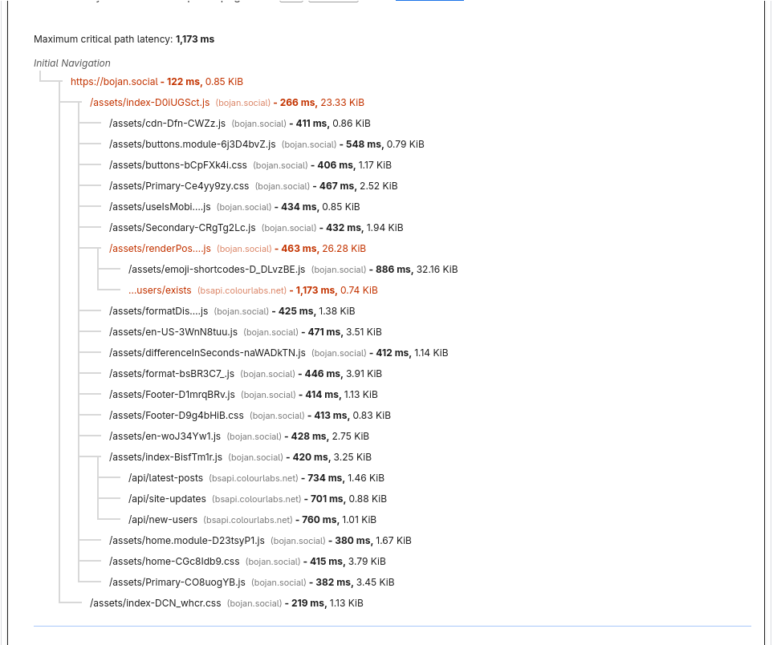

# anaemia

a work in progress high-performance SolidJS SSR framework built for large codebases ([such as bojanSocial](https://bojan.social))

---

## the problem:

- bojanSocial's web frontend is comprised with tons of components (100+) and over 100,000 lines of code. This is an issue with Vite's ES module based system due to fact it has to load tons of JavaScript for the initial page load. We wanted to move away from the issues of SPA while benefiting with hybrid rendering so we can focus on app speed and SEO 

- We abuse CSS modules (a ton) - every page on bojanSocial uses CSS modules with SCSS so we needed first class support for it. Our entire styling is custom and complex to acive the look we want.

- We are terrible at making maintainable codebases and remembering how to structure them without turning into a mess, so we get the computer and our past selves to it for us ;) 

This is pretty bad as the browser has to send tons of requests just to get a home page. This is the network-dependency tree just for the index page alone on desktop (with lazy-loading). The home page where most of our users use the application is another thing all together



- We needed an opinionated way to build features and apps and to onboard people, which SolidStart lacks

---

## the solution: why anaemia?

anaemia bridges the gap between SolidJS's fine-grained reactivity and industrial-grade bundling.

### rspack as the bundler

ByteDance's [Rspack](https://rspack.dev) allows us to use tried and tested webpack ecosystem modules while also being faster at Vite when bundling applications for development and production. anaemia avoids the ESM request storm entirely. It provides rapid HMR and bundle compilation while natively managing deep dependency trees without trying.

### SCSS and CSS module first class support

Built with native, aggressive support for heavy CSS Module architectures. Styles are optimized, chunked, and injected seamlessly during SSR without flashing unstyled content (FOUC) or flooding the browser network tab.

### strict architectural opinions

Unlike un-opinionated frameworks, anaemia enforces a rock-solid domain architecture (Features, Components, Pages, Hooks) out of the box. This is great for laying out standards in teams with multiple people working on features or just code quality. Teams can onboard instantly with our embedded code-generation CLI.

### custom plugin support

anaemia comes with a plugin API that allows anyone to mold the framework to whatever they want it to be, there is already bundled in [LightningCSS](https://lightningcss.dev/) support with `anaemiaLightningCssPlugin` in `@anaemia/core/plugins`.

This means you can customize the Rspack bundle configuration to whatever your needs need it to be and transform server HTML before it's sent to the user.  

---

## quick start

### 1. scaffold a New Project
Run the initialization wizard via your node package manager:

```bash
pnpm dlx @anaemia/cli create my-app
```

### 2. launch the development server

```bash
cd my-app
pnpm install
pnpm run dev
```

Your application will boot with an HMR bridge link running natively at `http://localhost:3000` or the port you configure in `anaemia.config.ts`.

## embedded code generation

anaemia keeps large engineering teams uniform by scaffolding domain logic via the CLI:

```bash
# scaffold an entirely isolated domain feature
anaemia create feature:authentication

# generate shared user-interface elements
anaemia create component:Button

# scaffold structural routing
anaemia create page:dashboard/analytics
```

## repository architecture

anaemia is managed as a pnpm monorepo workspace:

- `packages/core` - Core SSR runtime, state hydration, and framework primitives.
- `packages/bundler` - Custom Rspack compiler configurations for server/client.
- `packages/cli` - Scaffolding engine and dev/build orchestration binary.
- `templates/base-app` - The default engineering blueprint used by `anaemia create`.

## documentation

More documentation is a work in progress but you can see for yourself in the `docs/` folder