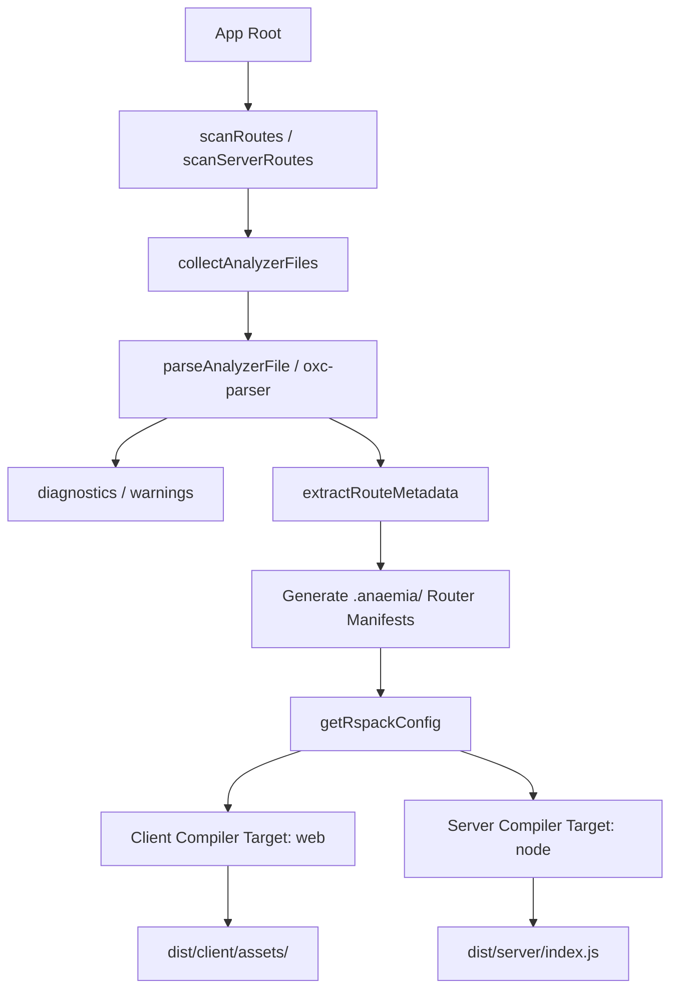
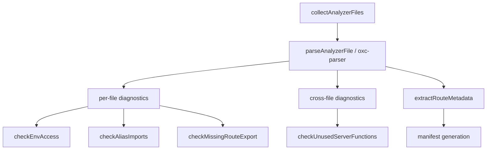

# how does anaemia work? - the architecture

## compilation & bundling lifecycle

anaemia splits compilation into two parallel Rspack compilation pipelines: a Client compiler (targeting `web`) and a server compiler (targetting `node`). This allows developers to author monolithic SolidJS codebases that run seamlessly across the server/client boundary.



### 1. static analysis & virtual entrypoints

before Rspack kicks off asset analysis, the framework performs a pre-bundling orchestration step to discover user application routes dynamically.

- route scanning: `scanRoutes(appRoot)` traverses the user's project file tree to locate edge nodes and entry points.
- manifest aggregation: writeManifest() flushes a layout config scheme directly onto disk at `<app root>/.anaemia`.
- virtual alias injections: the compiler injects a highly specific resolution rule into the shared module path solver:

```ts
alias: { "anaemia-user-app": entryFile }

// and stuff that is included here
export function getAliases(appRoot: string) {
  return {
    "~": path.resolve(appRoot, "./src"),
    "@core": path.resolve(appRoot, "./src/core"),
    "@shared": path.resolve(appRoot, "./src/shared"),
    "@features": path.resolve(appRoot, "./src/features"),
    "@routes": path.resolve(appRoot, "./src/routes"),
  };
}
```

this decouples the underlying framework runtime from concrete file structural locations. The core engine simply imports "anaemia-user-app", and Rspack maps this straight
the virtual routing entry.

---

### 2. dual-compiler splits

the core orchestration engine returns a tuple containing two entirely distinct environments: `[clientConfig, serverConfig]`.

#### the client compilation `(target: "web")`

optimized for cold asset deliveries, chunk sizes, and aggressive caching mechanics.

condition names: the module system evaluates code blocks prioritizing `["solid", "browser", "import"]`.

state context isolation: to prevent Node-specific features from hitting production web bundles, the context files are swapped out at compile time:
`[path.resolve(coreRuntimeDir, "./src/runtime/context.ts")]: path.resolve(coreRuntimeDir, "./src/runtime/context.browser.ts")`

Babel transformation loop: applies the custom internal `clientServerFnTransform` alongside `solid-refresh` to enable HMR without tearing down the browser context.

#### the server compilation `(target: "node")`

outputs a clean ESM server bundle capable of performing low-latency string-stream rendering.

target output: compiles down to an absolute single execution script (`dist/server/index.js`) exported as an native ES module:

```ts
output: { module: true, chunkFormat: "module", chunkLoading: "import" }
```

server hash injection: utilizes a custom `serverHashInjector` plugin inside its Babel ruleset. this acts as an identification step for server functions, ensuring client RPC calls mapping to the backend can resolve their execution blocks securely via hash tokens.

### 3. multi-tier HMR bridge

during development configurations, anaemia operates a multi-tiered socket architecture to bypass unbundled ESM network waterfalls while keeping hot reload states intact.

```
┌──────────────────────┐             ┌─────────────────────┐             ┌──────────────────┐
│  Rspack dev-server   │             │  anaemia HMR Bridge │             │  client browser  │
│ (port: targetPort+1) │ <=========> │ (port: targetPort+2)│ <=========> │(port: targetPort)│
└──────────────────────┘             └─────────────────────┘             └──────────────────┘
```

1. rspack dev-server (targetPort + 1): emits chunk delta calculations and manages the base code-graph states.

2. HMR bridge WebSocket (targetPort + 2): an abstraction WS server running within the CLI. It acts as a specialized proxy that manages incoming framework-level updates, proxies chunks, and handles reconnection health checks.

3. application gateway (targetPort): the main node.js (hono) web server handling the live, hydrated page request flows.

## server function bridge

anaemia allows seamless execution of server-side logic inside client components via `runOnServer()` API. the framework guarantees zero-leak client compilation through its custom Babel AST transformer:

1. compilation phase: the client compiler utilizes `clientServerFnTransform` custom plugin to identify backend code clusters. it strips out the internal logic bodies, preventing database credentials or private modules from leaking into client-side asset distributions.

2. deterministic targeting: using code mapping variables (file path + token character position), a cryptographic hash is mapped to the entry location.

3. network synthesis: the function is rewritten to use `@anaemia/core`'s internal HTTP payload manager (`$$executeClientRpc`). when invoked in the browser, it seamlessly triggers an automated POST request containing the arguments payload targeting the specific function hash.

Here's how you could extend the architecture doc with those two sections:

---

### 4. static analysis pipeline

before compilation begins, anaemia runs a full AST analysis pass over the user's application using `oxc-parser`. this catches structural and architectural issues at build time rather than runtime.



the analyzer classifies every file in the project by kind (`route`, `server-route`, `root`, `config`, `source`) and runs targeted checks against each:

- **env access** - warns when client files access `process.env` or non-`PUBLIC_` prefixed `import.meta.env` variables that would be undefined in the browser
- **alias imports** - warns when relative imports escape into aliased directories (`@core`, `@shared`, `@features` etc) and suggests the correct alias
- **missing route exports** - errors when a route file has no default export, which would cause a silent runtime failure
- **unused server functions** - cross-file check that warns when a `runOnServer()` definition is never imported anywhere in the application

route metadata extracted during this pass feeds directly into the manifest generation step, giving the compiler accurate static information about which routes are dynamic, have guards, or use server functions.

---

### 5. environment variable injection

anaemia enforces a strict client/server environment variable boundary at both static analysis and compile time.

- **`PUBLIC_` prefix convention** — only variables prefixed with `PUBLIC_` are safe to access in client code. the static analyzer warns on violations before the build runs.
- **build-time injection** — the bundler reads `.env` files and injects `PUBLIC_` variables into the client bundle via Rspack's `DefinePlugin`, replacing `import.meta.env.PUBLIC_*` references with their literal values at compile time. server-only variables are never included in the client compilation pass.
- **runtime server env** — server-side variables are loaded at boot time and accessed via `import.meta.env` in server routes and `.server.ts` files, where the full environment is available without restriction.

this means client bundles can never accidentally ship secrets - the boundary is enforced at the analyser, the compiler, and the module replacement level simultaneously.